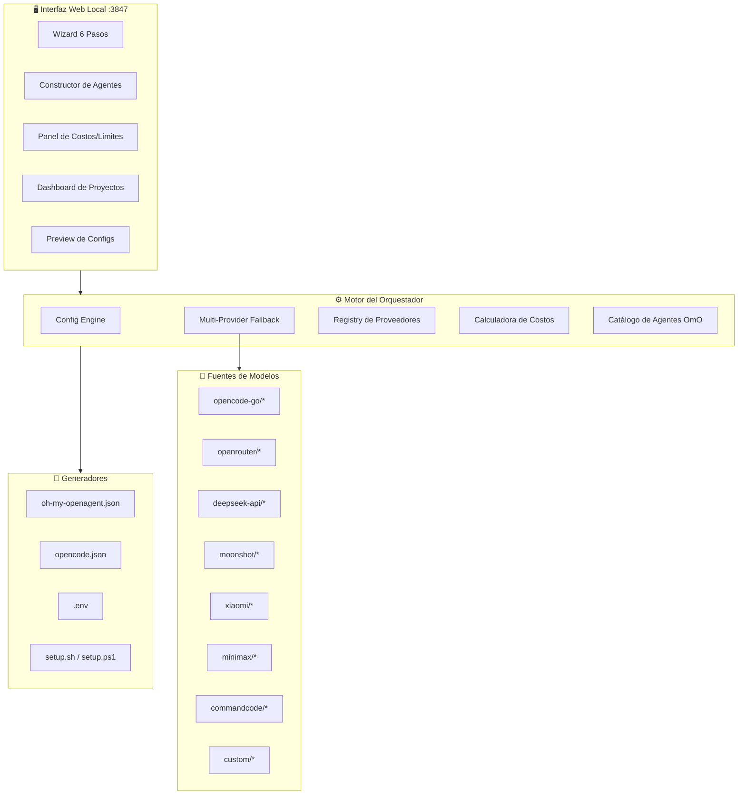
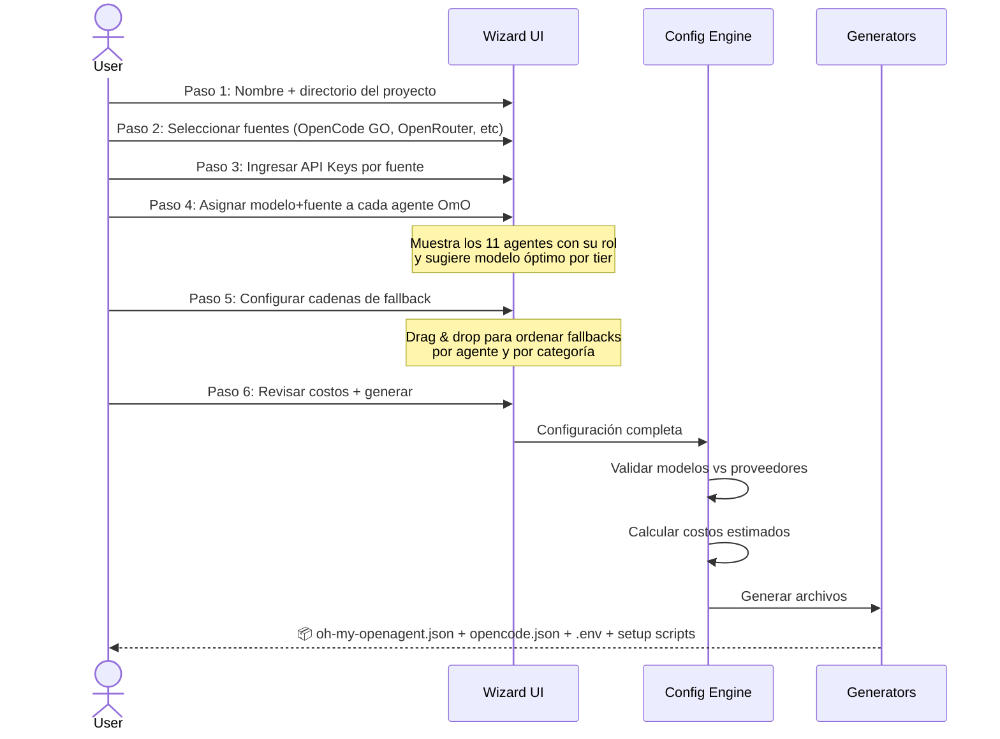
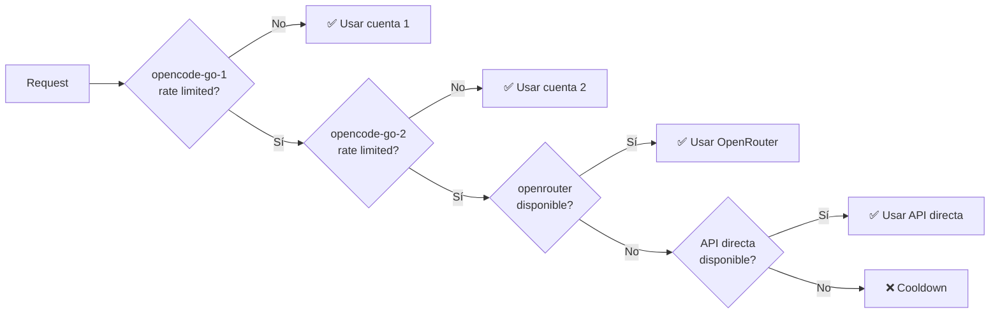

# Orquestador VibeCoding Multi-Proveedor

Un sistema visual para configurar, gestionar y desplegar entornos de AI coding multi-proveedor basados en **Oh My OpenAgent + OpenCode GO**, con soporte para múltiples fuentes de modelos y portabilidad total.

## Contexto

El artículo de Jatin K. Malik muestra cómo usar Oh My OpenAgent (OmO) para routing inteligente de modelos en OpenCode GO. Sin embargo, la configuración del artículo usa **solo un proveedor** (`opencode-go/`). 

**Este proyecto extiende ese concepto** permitiendo:
- Usar **múltiples fuentes** para el mismo modelo (DeepSeek via OpenCode GO, via OpenRouter, via API directa)
- **Múltiples cuentas/suscripciones** del mismo proveedor (2× OpenCode Go, 2× CommandCode, 2× Xiaomi MiMo = duplicar rate limits)
- **Fallback entre proveedores Y entre cuentas** (si `opencode-go-1/kimi-k2.6` alcanza su límite → `opencode-go-2/kimi-k2.6` → `openrouter/kimi-k2.6`)
- **Configuración visual** paso a paso en vez de editar JSON manualmente
- **Portabilidad total** para desplegar en VMs nuevas desde cero

### Stack de Herramientas

| Herramienta | Rol | Instalación |
|-------------|-----|-------------|
| **OpenCode GO** | Agente terminal principal | `curl -fsSL https://opencode.ai/install \| bash` |
| **Oh My OpenAgent** | Capa de orquestación/routing | `bunx oh-my-opencode install` |
| **CommandCode IA** | Agente terminal con taste profiles | `npm i -g command-code` |
| **OpenRouter** | API agregadora (200+ modelos) | Solo API Key |
| **Xiaomi MiMo** | API directa para modelos MiMo | Solo API Key |
| **DeepSeek API** | API directa DeepSeek | Solo API Key |
| **Moonshot/Kimi API** | API directa Kimi | Solo API Key |

---

## Decisiones Confirmadas

| Pregunta | Respuesta |
|----------|-----------|
| **Alcance** | Solo genera configs (`oh-my-openagent.json`, `opencode.json`, `.env`, scripts, README) |
| **OmO** | Sí lo usa. Replicar y personalizar para sus necesidades |
| **SO de VMs** | Linux (Ubuntu y Debian) |
| **Suscripciones actuales** | 1× OpenCode Go, 1× CommandCode, 1× Xiaomi MiMo, API OpenRouter |
| **Agentes custom** | Sí. Incluir README detallado de cada agente |
| **Monitoreo de costos** | Sí, en tiempo real. Poder cambiar cuenta/API fácilmente |

> [!WARNING]
> **API Keys**: Se guardarán en `.env` local, nunca se enviarán a servidores externos. El `.gitignore` las excluirá automáticamente.

---

## Arquitectura General



### Flujo del Wizard



---

## La Innovación: Prefijos Multi-Proveedor + Multi-Cuenta

El artículo usa solo `opencode-go/` como prefijo. **Nuestro orquestador extiende esto** con múltiples prefijos de fuente **Y múltiples cuentas por proveedor**:

```jsonc
// Config del artículo (single provider, single account):
"sisyphus": {
  "model": "opencode-go/kimi-k2.6",
  "fallback_models": ["opencode-go/deepseek-v4-pro"]
}

// NUESTRA config (multi-provider + multi-account fallback):
"sisyphus": {
  "model": "opencode-go-1/kimi-k2.6",          // Primario: Cuenta 1 OpenCode Go
  "fallback_models": [
    "opencode-go-2/kimi-k2.6",                  // Fallback 1: Cuenta 2 OpenCode Go (¡DUPLICA limits!)
    "openrouter/kimi-k2.6",                      // Fallback 2: via OpenRouter (pay-per-use)
    "moonshot/kimi-k2.6",                        // Fallback 3: via API directa Moonshot
    "opencode-go-1/deepseek-v4-pro"              // Fallback 4: otro modelo, Cuenta 1
  ]
}
```

### ¿Por qué Multi-Cuenta?

> [!TIP]
> Con **2 cuentas de OpenCode Go** ($20/mo total), tus límites se duplican:
> - Kimi K2.6: 1,150 → **2,300 req/5hr**
> - DeepSeek V4 Pro: 3,300 → **6,600 req/5hr**
> - Budget: $12 → **$24/5hr window**
> 
> El sistema rota automáticamente entre cuentas cuando una alcanza su límite.

### Convención de Nombres

- **Cuenta única**: `opencode-go/` (sin número = cuenta por defecto)
- **Múltiples cuentas**: `opencode-go-1/`, `opencode-go-2/`, `opencode-go-3/`...
- Aplica a **todos** los proveedores con suscripción: `commandcode-1/`, `commandcode-2/`, `xiaomi-1/`, `xiaomi-2/`

### Prefijos de Fuente Soportados

| Prefijo | Fuente | Costo | Límites | Multi-Cuenta |
|---------|--------|-------|---------|:------------:|
| `opencode-go/` | OpenCode Go ($10/mo) | Incluido en suscripción | $12/5hr, $30/week, $60/mo | ✅ Sí |
| `commandcode/` | CommandCode IA | Por plan | Por plan | ✅ Sí |
| `xiaomi/` | Xiaomi MiMo API | $0.10-1.00/1M input | Por plan | ✅ Sí |
| `openrouter/` | OpenRouter API | Pay-per-use (sin markup) | Por proveedor | ✅ Sí |
| `deepseek-api/` | DeepSeek API directa | $0.14-0.60/1M input | Generosos | ✅ Sí |
| `moonshot/` | Kimi/Moonshot API | $0.60/1M input | Por plan | ✅ Sí |
| `minimax/` | MiniMax API | $0.30-0.70/1M input | Por plan | ✅ Sí |
| `custom/` | Endpoint personalizado | Variable | Variable | ✅ Sí |

### Estrategia de Rotación de Cuentas



---

## Proposed Changes

### 1. Estructura del Proyecto

```
ORQUESTADOR/
├── package.json
├── server.js                        # Servidor Express :3847
├── .env.example
├── .gitignore
│
├── src/
│   ├── core/
│   │   ├── config-engine.js         # Motor de configuración
│   │   ├── fallback-router.js       # Sistema de fallback multi-proveedor
│   │   ├── account-manager.js       # Gestión multi-cuenta por proveedor
│   │   ├── provider-registry.js     # Registro de fuentes
│   │   ├── cost-calculator.js       # Calculadora con rate limits OmO
│   │   └── project-manager.js       # CRUD de proyectos
│   │
│   ├── providers/
│   │   ├── base-provider.js         # Clase base
│   │   ├── opencode-go.js           # OpenCode Go (modelos incluidos)
│   │   ├── openrouter.js            # OpenRouter API
│   │   ├── deepseek-api.js          # DeepSeek directo
│   │   ├── moonshot.js              # Kimi/Moonshot directo
│   │   ├── xiaomi-mimo.js           # Xiaomi MiMo directo
│   │   ├── minimax.js               # MiniMax directo
│   │   ├── commandcode.js           # CommandCode IA
│   │   └── custom.js                # Endpoint personalizado
│   │
│   ├── generators/
│   │   ├── omo-config.js            # Genera oh-my-openagent.json
│   │   ├── opencode-config.js       # Genera opencode.json
│   │   ├── env-generator.js         # Genera .env
│   │   ├── setup-script.js          # Genera setup.sh (Ubuntu/Debian)
│   │   └── readme-generator.js      # 📖 Genera AGENTS-README.md
│   │
│   └── data/
│       ├── agents-catalog.json      # 11 agentes OmO + custom
│       ├── models-catalog.json      # Modelos con precios y benchmarks
│       ├── providers-catalog.json   # Proveedores con endpoints
│       └── templates.json           # Templates predefinidos
│
├── public/
│   ├── index.html                   # SPA principal
│   ├── index.css                    # Design system (dark, glassmorphism)
│   ├── app.js                       # Router + state management
│   │
│   ├── components/
│   │   ├── wizard/
│   │   │   ├── wizard-container.js  # Contenedor del wizard
│   │   │   ├── step-project.js      # Paso 1: Proyecto
│   │   │   ├── step-sources.js      # Paso 2: Fuentes + Cuentas
│   │   │   ├── step-apikeys.js      # Paso 3: API Keys
│   │   │   ├── step-agents.js       # Paso 4: Agentes → Modelos
│   │   │   ├── step-fallbacks.js    # Paso 5: Cadenas fallback
│   │   │   └── step-review.js       # Paso 6: Revisar + Generar
│   │   │
│   │   ├── shared/
│   │   │   ├── model-card.js        # Card de modelo con benchmark
│   │   │   ├── agent-card.js        # Card de agente OmO
│   │   │   ├── provider-badge.js    # Badge de proveedor
│   │   │   ├── fallback-chain.js    # Editor visual de cadena
│   │   │   ├── cost-bar.js          # Barra de costo comparativa
│   │   │   ├── config-preview.js    # Preview JSON con syntax highlight
│   │   │   └── account-switcher.js  # 🔄 Quick-switch de cuenta/API
│   │   │
│   │   ├── dashboard.js             # Lista de proyectos
│   │   ├── cost-monitor.js          # 📊 Monitor de costos en TIEMPO REAL
│   │   ├── account-manager-ui.js    # 🔑 Gestión visual de cuentas
│   │   └── export-panel.js          # Exportar ZIP
│   │
│   └── assets/
│       └── icons/                   # SVG icons para agentes
│
├── projects/                        # Proyectos guardados (JSON)
│   └── .gitkeep
│
├── templates/                       # Templates predefinidos
│   ├── mi-setup-actual.json         # Tu setup: 1×OC + 1×CC + 1×Xiaomi + OR
│   ├── budget-single.json           # Solo 1× OpenCode Go
│   ├── dual-account-power.json      # 2× OpenCode Go
│   ├── balanced-multi.json          # Multi-proveedor con fallbacks
│   ├── ultra-resilience.json        # Máximo fallback
│   └── opencode-go-only.json        # Como el artículo original
│
└── scripts/
    ├── setup-ubuntu.sh              # Setup para Ubuntu
    ├── setup-debian.sh              # Setup para Debian
    └── deploy-vm.sh                 # Deploy todo-en-uno
```

---

### 2. Backend — API REST

#### [NEW] [server.js](file:///g:/Mi unidad/ANTIGRAVITY - PROYECTOS/ORQUESTADOR/server.js)

Servidor Express en `localhost:3847` con estos endpoints:

| Método | Endpoint | Descripción |
|--------|----------|-------------|
| `GET` | `/api/providers` | Lista fuentes disponibles con estado |
| `GET` | `/api/models` | Catálogo completo con precios + benchmarks |
| `GET` | `/api/agents` | Los 11 agentes OmO + agentes custom |
| `GET` | `/api/templates` | Templates predefinidos |
| `POST` | `/api/projects` | Crear proyecto nuevo |
| `GET` | `/api/projects` | Listar proyectos |
| `GET` | `/api/projects/:id` | Detalle de proyecto |
| `PUT` | `/api/projects/:id` | Actualizar proyecto |
| `DELETE` | `/api/projects/:id` | Eliminar proyecto |
| `POST` | `/api/projects/:id/generate` | Generar archivos de config |
| `GET` | `/api/projects/:id/export` | Exportar como ZIP |
| `POST` | `/api/projects/:id/deploy` | Generar script de deploy (Ubuntu/Debian) |
| `POST` | `/api/test-provider` | Test de conectividad a un proveedor |
| `GET` | `/api/cost-estimate` | Calcular costo estimado por configuración |
| | | |
| **Cuentas** | | |
| `GET` | `/api/accounts` | Listar todas las cuentas por proveedor |
| `POST` | `/api/accounts` | Agregar cuenta a un proveedor |
| `PUT` | `/api/accounts/:id` | Actualizar cuenta (key, label) |
| `DELETE` | `/api/accounts/:id` | Eliminar cuenta |
| `POST` | `/api/accounts/:id/test` | Test de conectividad de una cuenta |
| `PUT` | `/api/accounts/switch` | Quick-switch: cambiar cuenta activa |
| | | |
| **Costos** | | |
| `GET` | `/api/costs/summary` | Resumen de costos actual |
| `GET` | `/api/costs/by-provider` | Desglose por proveedor/cuenta |
| `GET` | `/api/costs/by-agent` | Desglose por agente |
| `GET` | `/api/costs/estimate` | Estimador "¿cuánto costaría X horas?" |
| | | |
| **Agentes Custom** | | |
| `GET` | `/api/custom-agents` | Listar agentes personalizados |
| `POST` | `/api/custom-agents` | Crear agente personalizado |
| `PUT` | `/api/custom-agents/:id` | Editar agente personalizado |
| `DELETE` | `/api/custom-agents/:id` | Eliminar agente personalizado |

---

### 3. Catálogos de Datos

#### [NEW] [agents-catalog.json](file:///g:/Mi unidad/ANTIGRAVITY - PROYECTOS/ORQUESTADOR/src/data/agents-catalog.json)

Los 11 agentes de Oh My OpenAgent con metadata para el UI:

```jsonc
{
  "agents": [
    {
      "id": "sisyphus",
      "name": "Sisyphus",
      "icon": "⚡",
      "role": "Main Orchestrator",
      "category": "orchestrator",
      "description": "Orquestador principal. Coordina todos los demás agentes.",
      "recommended_tier": 3,
      "recommended_models": ["kimi-k2.6", "glm-5.1"],
      "typical_requests_per_session": "50-200"
    },
    {
      "id": "hephaestus",
      "name": "Hephaestus",
      "icon": "🔨",
      "role": "Autonomous Deep Worker",
      "category": "deep-worker",
      "description": "Trabajador autónomo profundo. Implementaciones complejas multi-archivo.",
      "recommended_tier": 2,
      "recommended_models": ["deepseek-v4-pro", "kimi-k2.6"]
    },
    {
      "id": "oracle",
      "name": "Oracle",
      "icon": "🔮",
      "role": "Architecture Consultant",
      "category": "orchestrator",
      "description": "Consultor de arquitectura. Decisiones de diseño y razonamiento largo.",
      "recommended_tier": 3,
      "recommended_models": ["glm-5.1", "kimi-k2.6"]
    },
    {
      "id": "librarian",
      "name": "Librarian",
      "icon": "📚",
      "role": "Codebase Search",
      "category": "utility",
      "description": "Búsqueda en el codebase. Velocidad > inteligencia.",
      "recommended_tier": 1,
      "recommended_models": ["deepseek-v4-flash", "qwen3.5-plus"]
    },
    {
      "id": "explore",
      "name": "Explore",
      "icon": "🔍",
      "role": "Code Explorer",
      "category": "utility",
      "description": "Exploración de código. Búsqueda rápida.",
      "recommended_tier": 1,
      "recommended_models": ["deepseek-v4-flash"]
    },
    {
      "id": "multimodal-looker",
      "name": "Multimodal Looker",
      "icon": "👁️",
      "role": "Visual Engineering",
      "category": "specialized",
      "description": "Screenshot-to-code y análisis visual.",
      "recommended_tier": 4,
      "recommended_models": ["mimo-v2-omni"]
    },
    {
      "id": "prometheus",
      "name": "Prometheus",
      "icon": "📋",
      "role": "Planner",
      "category": "orchestrator",
      "description": "Planificador. Spec-writing y diseño arquitectónico.",
      "recommended_tier": 3,
      "recommended_models": ["glm-5.1", "qwen3.6-plus"]
    },
    {
      "id": "metis",
      "name": "Metis",
      "icon": "⚖️",
      "role": "Review Agent",
      "category": "review",
      "description": "Agente de revisión analítica.",
      "recommended_tier": 2,
      "recommended_models": ["qwen3.6-plus", "deepseek-v4-pro"]
    },
    {
      "id": "momus",
      "name": "Momus",
      "icon": "🎭",
      "role": "Critical Reviewer",
      "category": "review",
      "description": "Revisor crítico. Encuentra debilidades.",
      "recommended_tier": 2,
      "recommended_models": ["qwen3.6-plus", "kimi-k2.6"]
    },
    {
      "id": "atlas",
      "name": "Atlas",
      "icon": "🌍",
      "role": "Heavy Lifter",
      "category": "deep-worker",
      "description": "Trabajador pesado. Tareas de terminal intensivas.",
      "recommended_tier": 2,
      "recommended_models": ["deepseek-v4-pro", "deepseek-v4-flash"]
    },
    {
      "id": "code-reviewer",
      "name": "Code Reviewer",
      "icon": "✅",
      "role": "Quality Gate",
      "category": "review",
      "description": "Revisión de calidad de código. PR reviews.",
      "recommended_tier": 3,
      "recommended_models": ["kimi-k2.6", "deepseek-v4-pro"]
    },
    {
      "id": "sisyphus-junior",
      "name": "Sisyphus Junior",
      "icon": "⚡",
      "role": "Quick Tasks",
      "category": "utility",
      "description": "Tareas rápidas y simples. Bugs de 1-2 archivos.",
      "recommended_tier": 1,
      "recommended_models": ["deepseek-v4-flash"]
    }
  ]
}
```

#### [NEW] [models-catalog.json](file:///g:/Mi unidad/ANTIGRAVITY - PROYECTOS/ORQUESTADOR/src/data/models-catalog.json)

```jsonc
{
  "models": [
    {
      "id": "kimi-k2.6",
      "name": "Kimi K2.6",
      "tier": 3,
      "benchmarks": { "swe_pro": 58.6, "swe_verified": 81.5 },
      "limits_opencode_go": { "req_per_5hr": 1150 },
      "pricing_direct": { "input_per_1m": 0.60, "output_per_1m": 2.50 },
      "available_sources": [
        { "prefix": "opencode-go", "model_id": "kimi-k2.6" },
        { "prefix": "openrouter", "model_id": "moonshot/kimi-k2.6" },
        { "prefix": "moonshot", "model_id": "kimi-k2.6", "base_url": "https://api.moonshot.ai/v1" }
      ],
      "best_for": ["orchestration", "agentic-coding", "multi-file-refactoring"]
    },
    {
      "id": "deepseek-v4-flash",
      "name": "DeepSeek V4 Flash",
      "tier": 1,
      "benchmarks": { "swe_verified": 79.0 },
      "limits_opencode_go": { "req_per_5hr": 31650 },
      "pricing_direct": { "input_per_1m": 0.14, "output_per_1m": 0.28 },
      "available_sources": [
        { "prefix": "opencode-go", "model_id": "deepseek-v4-flash" },
        { "prefix": "openrouter", "model_id": "deepseek/deepseek-v4-flash" },
        { "prefix": "deepseek-api", "model_id": "deepseek-v4-flash", "base_url": "https://api.deepseek.com" }
      ],
      "best_for": ["volume-tasks", "code-completion", "search", "quick-fixes"]
    },
    {
      "id": "deepseek-v4-pro",
      "name": "DeepSeek V4 Pro",
      "tier": 2,
      "benchmarks": { "swe_pro": 55.4, "swe_verified": 80.6, "livecode": 93.5 },
      "limits_opencode_go": { "req_per_5hr": 3300 },
      "pricing_direct": { "input_per_1m": 1.60, "output_per_1m": 3.48 },
      "available_sources": [
        { "prefix": "opencode-go", "model_id": "deepseek-v4-pro" },
        { "prefix": "openrouter", "model_id": "deepseek/deepseek-v4-pro" },
        { "prefix": "deepseek-api", "model_id": "deepseek-v4-pro", "base_url": "https://api.deepseek.com" }
      ],
      "best_for": ["feature-implementation", "debugging", "standard-engineering"]
    },
    {
      "id": "glm-5.1",
      "name": "GLM-5.1",
      "tier": 3,
      "benchmarks": { "swe_pro": 58.4 },
      "limits_opencode_go": { "req_per_5hr": 880 },
      "available_sources": [
        { "prefix": "opencode-go", "model_id": "glm-5.1" },
        { "prefix": "openrouter", "model_id": "thudm/glm-5.1" }
      ],
      "best_for": ["architecture", "long-horizon-reasoning", "spec-writing"]
    },
    {
      "id": "qwen3.6-plus",
      "name": "Qwen 3.6 Plus",
      "tier": 2,
      "benchmarks": { "terminal_bench": 61.6 },
      "limits_opencode_go": { "req_per_5hr": 3300 },
      "available_sources": [
        { "prefix": "opencode-go", "model_id": "qwen3.6-plus" },
        { "prefix": "openrouter", "model_id": "qwen/qwen3.6-plus" }
      ],
      "best_for": ["terminal-automation", "reviews", "writing", "universal-fallback"]
    },
    {
      "id": "mimo-v2-omni",
      "name": "MiMo-V2-Omni",
      "tier": 4,
      "available_sources": [
        { "prefix": "opencode-go", "model_id": "mimo-v2-omni" },
        { "prefix": "openrouter", "model_id": "xiaomi/mimo-v2-omni" },
        { "prefix": "xiaomi", "model_id": "mimo-v2-omni" }
      ],
      "best_for": ["screenshot-to-code", "visual-engineering", "multimodal"]
    },
    {
      "id": "mimo-v2.5-pro",
      "name": "MiMo-V2.5 Pro",
      "tier": 3,
      "pricing_direct": { "input_per_1m": 1.00, "output_per_1m": 3.00 },
      "available_sources": [
        { "prefix": "opencode-go", "model_id": "mimo-v2.5-pro" },
        { "prefix": "openrouter", "model_id": "xiaomi/mimo-v2.5-pro" },
        { "prefix": "xiaomi", "model_id": "mimo-v2.5-pro" }
      ],
      "best_for": ["complex-reasoning", "agentic-coding"]
    },
    {
      "id": "mimo-v2-flash",
      "name": "MiMo-V2 Flash",
      "tier": 1,
      "pricing_direct": { "input_per_1m": 0.10, "output_per_1m": 0.30 },
      "available_sources": [
        { "prefix": "openrouter", "model_id": "xiaomi/mimo-v2-flash" },
        { "prefix": "xiaomi", "model_id": "mimo-v2-flash" }
      ],
      "best_for": ["ultra-budget", "volume-tasks"]
    },
    {
      "id": "minimax-m3",
      "name": "MiniMax M3",
      "tier": 2,
      "pricing_direct": { "input_per_1m": 0.30, "output_per_1m": 1.20 },
      "available_sources": [
        { "prefix": "openrouter", "model_id": "minimax/minimax-m3" },
        { "prefix": "minimax", "model_id": "MiniMax-M3", "base_url": "https://api.minimax.io/v1" }
      ],
      "best_for": ["coding", "tool-use"]
    },
    {
      "id": "qwen3.5-plus",
      "name": "Qwen 3.5 Plus",
      "tier": 1,
      "limits_opencode_go": { "req_per_5hr": 10000 },
      "available_sources": [
        { "prefix": "opencode-go", "model_id": "qwen3.5-plus" },
        { "prefix": "openrouter", "model_id": "qwen/qwen3.5-plus" }
      ],
      "best_for": ["code-completion", "simple-tasks"]
    },
    {
      "id": "minimax-m2.5",
      "name": "MiniMax M2.5",
      "tier": 1,
      "available_sources": [
        { "prefix": "opencode-go", "model_id": "minimax-m2.5" },
        { "prefix": "openrouter", "model_id": "minimax/minimax-m2.5" }
      ],
      "best_for": ["volume-tasks", "code-completion"]
    }
  ],
  "tiers": {
    "1": { "name": "Volume Workhorse", "color": "#22c55e", "description": "Never rate-limited. 80% of tasks." },
    "2": { "name": "Standard Engineering", "color": "#3b82f6", "description": "Balanced cost/quality." },
    "3": { "name": "Complex Agentic", "color": "#a855f7", "description": "Elite. Use deliberately." },
    "4": { "name": "Specialized", "color": "#f59e0b", "description": "Multimodal, long-horizon." }
  }
}
```

---

### 4. Core — Motor del Orquestador

#### [NEW] [config-engine.js](file:///g:/Mi unidad/ANTIGRAVITY - PROYECTOS/ORQUESTADOR/src/core/config-engine.js)
Motor central que:
- Toma la configuración del wizard y la transforma en `oh-my-openagent.json`
- Valida que cada modelo seleccionado esté disponible en la fuente elegida
- Resuelve las cadenas de fallback multi-proveedor Y multi-cuenta
- Genera `opencode.json` con los providers necesarios (incluyendo múltiples instancias)

#### [NEW] [account-manager.js](file:///g:/Mi unidad/ANTIGRAVITY - PROYECTOS/ORQUESTADOR/src/core/account-manager.js)
Gestor de múltiples cuentas por proveedor:
- CRUD de cuentas: agregar/editar/eliminar cuentas por proveedor
- Almacena credenciales con sufijo numérico: `OPENCODE_GO_1_API_KEY`, `OPENCODE_GO_2_API_KEY`
- Calcula **límites agregados** por proveedor (2 cuentas OC Go = $24/5hr)
- Test de conectividad individual por cuenta
- Genera la estructura de `.env` con todas las cuentas

Estructura de datos interna:
```jsonc
{
  "accounts": {
    "opencode-go": [
      { "id": "opencode-go-1", "label": "Cuenta Principal", "email": "user1@...", "env_key": "OPENCODE_GO_1_AUTH" },
      { "id": "opencode-go-2", "label": "Cuenta Backup", "email": "user2@...", "env_key": "OPENCODE_GO_2_AUTH" }
    ],
    "commandcode": [
      { "id": "commandcode-1", "label": "CC Principal", "env_key": "COMMANDCODE_1_API_KEY" },
      { "id": "commandcode-2", "label": "CC Backup", "env_key": "COMMANDCODE_2_API_KEY" }
    ],
    "xiaomi": [
      { "id": "xiaomi-1", "label": "MiMo Principal", "env_key": "XIAOMI_1_API_KEY" },
      { "id": "xiaomi-2", "label": "MiMo Backup", "env_key": "XIAOMI_2_API_KEY" }
    ],
    "openrouter": [
      { "id": "openrouter", "label": "OpenRouter", "env_key": "OPENROUTER_API_KEY" }
    ]
  }
}
```

#### [NEW] [fallback-router.js](file:///g:/Mi unidad/ANTIGRAVITY - PROYECTOS/ORQUESTADOR/src/core/fallback-router.js)
Sistema de fallback multi-proveedor + multi-cuenta:
- **Intra-account**: mismo modelo, otra cuenta del mismo proveedor (`opencode-go-1/kimi → opencode-go-2/kimi`)
- **Intra-provider**: mismo modelo, diferente fuente (`opencode-go/kimi → openrouter/kimi → moonshot/kimi`)
- **Inter-model**: diferente modelo como fallback (`kimi-k2.6 → deepseek-v4-pro`)
- **Strategies**: `on-error`, `on-rate-limit`, `round-robin` (rotar entre cuentas)
- Genera la sección `runtime_fallback` del config
- Auto-genera cadenas de fallback óptimas basadas en las cuentas disponibles

#### [NEW] [cost-calculator.js](file:///g:/Mi unidad/ANTIGRAVITY - PROYECTOS/ORQUESTADOR/src/core/cost-calculator.js)
Calcula con soporte multi-cuenta:
- **Costos de suscripción agregados**: 2× OpenCode Go = $20/mo, 2× CommandCode = $X/mo
- **Rate limits agregados**: 2 cuentas OC Go → K2.6 tiene 2,300 req/5hr combinados
- Budget por ventana de 5hr: $12 × N cuentas = $12N/5hr
- Costo directo por API cuando se usa como fallback
- Estimación por tipo de sesión (light: 30 req, medium: 100, heavy: 200+)
- **Dashboard visual**: "Con 1 cuenta: llegas a X sesiones/día. Con 2 cuentas: llegas a Y sesiones/día"
- Punto de equilibrio: "¿Cuándo conviene agregar una 2da cuenta vs usar OpenRouter?"

#### [NEW] [provider-registry.js](file:///g:/Mi unidad/ANTIGRAVITY - PROYECTOS/ORQUESTADOR/src/core/provider-registry.js)
- Registro de todas las fuentes con sus endpoints y auth
- Soporta múltiples instancias del mismo proveedor
- Test de conectividad por cuenta individual
- Mapa de disponibilidad: ¿qué modelos tiene cada fuente/cuenta?

---

### 5. Generadores de Configuración

#### [NEW] [omo-config.js](file:///g:/Mi unidad/ANTIGRAVITY - PROYECTOS/ORQUESTADOR/src/generators/omo-config.js)
**El generador más importante.** Produce `oh-my-openagent.json` compatible con OmO:

```jsonc
{
  "$schema": "https://raw.githubusercontent.com/code-yeongyu/oh-my-openagent/dev/assets/oh-my-opencode.schema.json",
  "model_fallback": true,
  "runtime_fallback": {
    "enabled": true,
    "retry_on_errors": [400, 429, 503, 529],
    "max_fallback_attempts": 5,         // ← Más intentos por tener más cuentas
    "cooldown_seconds": 60,
    "timeout_seconds": 30,
    "notify_on_fallback": true
  },
  "agents": {
    "sisyphus": {
      "model": "opencode-go-1/kimi-k2.6",           // ← Cuenta 1
      "fallback_models": [
        "opencode-go-2/kimi-k2.6",                   // ← Cuenta 2 (¡mismos limits!)
        "openrouter/moonshot/kimi-k2.6",              // ← Proveedor diferente
        "moonshot/kimi-k2.6",                         // ← API directa
        "opencode-go-1/deepseek-v4-pro"               // ← Otro modelo, Cuenta 1
      ],
      "ultrawork": { "model": "opencode-go-1/kimi-k2.6", "variant": "max" }
    },
    "hephaestus": {
      "model": "opencode-go-1/deepseek-v4-pro",
      "fallback_models": [
        "opencode-go-2/deepseek-v4-pro",              // ← Cuenta 2
        "opencode-go-1/deepseek-v4-flash",
        "openrouter/deepseek/deepseek-v4-flash",
        "opencode-go-2/kimi-k2.6"
      ]
    },
    "librarian": {
      "model": "opencode-go-1/deepseek-v4-flash",
      "fallback_models": "opencode-go-2/deepseek-v4-flash"  // ← Simple, mismo modelo, otra cuenta
    },
    "multimodal-looker": {
      "model": "opencode-go-1/mimo-v2-omni",
      "fallback_models": [
        "opencode-go-2/mimo-v2-omni",
        "xiaomi-1/mimo-v2-omni",                      // ← API directa Xiaomi, Cuenta 1
        "xiaomi-2/mimo-v2-omni"                       // ← API directa Xiaomi, Cuenta 2
      ]
    }
    // ... demás agentes
  },
  "categories": {
    "deep": {
      "model": "opencode-go-1/kimi-k2.6",
      "fallback_models": [
        "opencode-go-2/kimi-k2.6",
        "openrouter/moonshot/kimi-k2.6",
        "opencode-go-1/deepseek-v4-pro"
      ]
    },
    "quick": {
      "model": "opencode-go-1/deepseek-v4-flash",
      "fallback_models": "opencode-go-2/deepseek-v4-flash"
    },
    "visual-engineering": {
      "model": "opencode-go-1/mimo-v2-omni",
      "fallback_models": [
        "xiaomi-1/mimo-v2-omni",
        "xiaomi-2/mimo-v2-omni"
      ]
    }
    // ... demás categorías
  },
  "background_task": {
    "defaultConcurrency": 8,            // ← Más concurrencia con más cuentas
    "staleTimeoutMs": 180000,
    "providerConcurrency": {
      "opencode-go-1": 10,
      "opencode-go-2": 10,              // ← Cada cuenta tiene su propio pool
      "openrouter": 5,
      "xiaomi-1": 5,
      "xiaomi-2": 5
    },
    "modelConcurrency": {
      "opencode-go-1/kimi-k2.6": 2,
      "opencode-go-2/kimi-k2.6": 2,     // ← 2+2 = 4 concurrent K2.6 requests!
      "opencode-go-1/deepseek-v4-pro": 3,
      "opencode-go-2/deepseek-v4-pro": 3,
      "opencode-go-1/deepseek-v4-flash": 20,
      "opencode-go-2/deepseek-v4-flash": 20
    }
  }
}
```

#### [NEW] [opencode-config.js](file:///g:/Mi unidad/ANTIGRAVITY - PROYECTOS/ORQUESTADOR/src/generators/opencode-config.js)
Genera `opencode.json` con providers multi-cuenta:

```json
{
  "$schema": "https://opencode.ai/config.json",
  "model": "deepseek-v4-flash",
  "providers": {
    "openrouter": {
      "apiKey": "{env:OPENROUTER_API_KEY}",
      "baseURL": "https://openrouter.ai/api/v1"
    },
    "deepseek-direct": {
      "apiKey": "{env:DEEPSEEK_API_KEY}",
      "baseURL": "https://api.deepseek.com"
    },
    "moonshot": {
      "apiKey": "{env:MOONSHOT_API_KEY}",
      "baseURL": "https://api.moonshot.ai/v1"
    },
    "xiaomi-1": {
      "apiKey": "{env:XIAOMI_1_API_KEY}"
    },
    "xiaomi-2": {
      "apiKey": "{env:XIAOMI_2_API_KEY}"
    }
  },
  "theme": "opencode",
  "autoupdate": true
}
```

#### [NEW] [env-generator.js](file:///g:/Mi unidad/ANTIGRAVITY - PROYECTOS/ORQUESTADOR/src/generators/env-generator.js)
Genera `.env` con claves numeradas por cuenta:

```bash
# === ORQUESTADOR VIBECODING — API KEYS ===

# OpenCode Go — Cuenta 1 (Principal)
OPENCODE_GO_1_AUTH=token_cuenta_1_aqui
# OpenCode Go — Cuenta 2 (Backup)
OPENCODE_GO_2_AUTH=token_cuenta_2_aqui

# CommandCode — Cuenta 1
COMMANDCODE_1_API_KEY=cc_key_1_aqui
# CommandCode — Cuenta 2
COMMANDCODE_2_API_KEY=cc_key_2_aqui

# Xiaomi MiMo — Cuenta 1
XIAOMI_1_API_KEY=xiaomi_key_1_aqui
# Xiaomi MiMo — Cuenta 2
XIAOMI_2_API_KEY=xiaomi_key_2_aqui

# OpenRouter (una cuenta suele bastar)
OPENROUTER_API_KEY=or_key_aqui

# APIs Directas
DEEPSEEK_API_KEY=ds_key_aqui
MOONSHOT_API_KEY=ms_key_aqui
MINIMAX_API_KEY=mm_key_aqui
```
```

#### [NEW] [setup-script.js](file:///g:/Mi unidad/ANTIGRAVITY - PROYECTOS/ORQUESTADOR/src/generators/setup-script.js)
Genera scripts de deploy para Ubuntu/Debian:

```bash
#!/bin/bash
# === ORQUESTADOR VIBECODING — VM SETUP (Ubuntu/Debian) ===
set -e

echo "🚀 Instalando entorno VibeCoding..."

# 1. Prerequisitos
sudo apt update && sudo apt install -y curl git build-essential
command -v node || { curl -fsSL https://deb.nodesource.com/setup_22.x | sudo bash - && sudo apt install -y nodejs; }
command -v go || { wget -q https://go.dev/dl/go1.24.linux-amd64.tar.gz && sudo tar -C /usr/local -xzf go*.tar.gz && rm go*.tar.gz; }
export PATH=$PATH:/usr/local/go/bin
command -v bun || { curl -fsSL https://bun.sh/install | bash; }

# 2. Herramientas de VibeCoding
curl -fsSL https://opencode.ai/install | bash
npm i -g command-code
bunx oh-my-opencode install --no-tui --opencode-go=yes

# 3. Configs
mkdir -p ~/.config/opencode
cp opencode.json ~/.config/opencode/opencode.json
cp oh-my-openagent.json ~/.config/opencode/oh-my-openagent.json

# 4. Variables de entorno
if [ -f .env ]; then
  cp .env ~/.config/opencode/.env
  set -a && source .env && set +a
  echo "✅ Variables de entorno cargadas"
else
  echo "⚠️  No se encontró .env — crea uno con tus API keys"
  echo "   Usa .env.example como referencia"
fi

# 5. Auth
opencode auth login
cmd login  # CommandCode

# 6. Verificar
echo ""
echo "=== VERIFICACIÓN ==="
opencode --version
bunx oh-my-opencode doctor --verbose
opencode models
echo ""
echo "✅ Setup completo! Tu entorno está listo."
echo "📖 Lee AGENTS-README.md para entender cada agente."
```

#### [NEW] [readme-generator.js](file:///g:/Mi unidad/ANTIGRAVITY - PROYECTOS/ORQUESTADOR/src/generators/readme-generator.js)
Genera `AGENTS-README.md` personalizado para cada proyecto con:
- **Explicación de cada agente**: qué hace, cuándo usarlo, cómo invocarlo
- **Tabla de modelos asignados**: qué modelo usa cada agente y desde qué fuente
- **Cadenas de fallback**: qué pasa si falla cada agente
- **Guía de costos**: cuánto cuesta cada agente por sesión
- **Agentes custom**: documentación de los agentes personalizados del usuario

Ejemplo de salida:
```markdown
# 🤖 Guía de Agentes — Mi Proyecto

## Agentes Disponibles

### ⚡ Sisyphus (Orquestador Principal)
- **Qué hace**: Coordina todos los agentes. Planifica, delega y supervisa.
- **Cuándo usarlo**: Siempre. Es el punto de entrada para tareas complejas.
- **Modelo**: Kimi K2.6 via OpenCode Go
- **Fallback**: OpenRouter → Moonshot API directa
- **Costo por sesión**: ~$0.15-0.40

### 🔨 Hephaestus (Deep Worker)
- **Qué hace**: Implementaciones autónomas complejas (3-10 archivos).
- **Cuándo usarlo**: Features nuevas, refactoring grande.
- **Modelo**: DeepSeek V4 Pro via OpenCode Go
- **Costo por sesión**: ~$0.08-0.20
...

## Agentes Personalizados
### 🧪 Mi Test Agent
- **Qué hace**: Genera tests automatizados para mi stack.
...
```

---

### 6. Frontend — Interfaz Web

#### [NEW] [public/index.html](file:///g:/Mi unidad/ANTIGRAVITY - PROYECTOS/ORQUESTADOR/public/index.html)

#### Diseño Visual
- **Tema**: Dark premium con gradientes azul-púrpura (#0f0d1a → #1a1145)
- **Glassmorphism**: Cards con `backdrop-filter: blur(12px)` y bordes luminosos
- **Tipografía**: Inter (UI) + JetBrains Mono (código/configs)
- **Animaciones**: Transiciones suaves entre pasos del wizard, hover effects en cards
- **Colores de Tier**: Verde (T1), Azul (T2), Púrpura (T3), Ámbar (T4)
- **Badges de proveedor**: Cada fuente tiene su color distintivo

#### Vista Principal: Dashboard

```
┌─────────────────────────────────────────────────────────────┐
│  🎯 ORQUESTADOR VIBECODING                    [+ Nuevo]    │
│─────────────────────────────────────────────────────────────│
│                                                             │
│  📁 Mis Proyectos                                          │
│  ┌──────────────┐ ┌──────────────┐ ┌──────────────┐       │
│  │ 🟢 Web App   │ │ 🟡 API REST  │ │ ⚪ Nuevo...   │       │
│  │ 3 fuentes    │ │ 2 fuentes    │ │              │       │
│  │ 11 agentes   │ │ 8 agentes    │ │  [Crear]     │       │
│  │ $10+~$3/mo   │ │ $10/mo       │ │              │       │
│  └──────────────┘ └──────────────┘ └──────────────┘       │
│                                                             │
│  📊 Resumen de Costos                                      │
│  OpenCode Go: $10/mo (base)                                │
│  OpenRouter: ~$3-5/mo estimado (fallback)                  │
│  APIs directas: ~$1-2/mo (backup)                          │
└─────────────────────────────────────────────────────────────┘
```

#### Wizard: Paso 4 — Asignar Modelos a Agentes (Vista clave)

```
┌─────────────────────────────────────────────────────────────┐
│  PASO 4 de 6: Asignar Modelos a Agentes                    │
│  ─────────────────────────────────────────────────────────  │
│                                                             │
│  Template: [Budget Chinese ▼] [Performance ▼] [Custom ▼]   │
│                                                             │
│  ┌─── TIER 3: Complex Agentic ──── 🟣 ──────────────────┐ │
│  │                                                        │ │
│  │  ⚡ Sisyphus (Orchestrator)                            │ │
│  │  Modelo: [Kimi K2.6        ▼]  58.6% SWE-Pro         │ │
│  │  Fuente: [opencode-go      ▼]  1,150 req/5hr         │ │
│  │                                                        │ │
│  │  🔮 Oracle (Architecture)                              │ │
│  │  Modelo: [GLM-5.1          ▼]  58.4% SWE-Pro         │ │
│  │  Fuente: [opencode-go      ▼]  880 req/5hr           │ │
│  │                                                        │ │
│  │  ✅ Code Reviewer                                      │ │
│  │  Modelo: [Kimi K2.6        ▼]  58.6% SWE-Pro         │ │
│  │  Fuente: [opencode-go      ▼]  1,150 req/5hr         │ │
│  │                                                        │ │
│  └────────────────────────────────────────────────────────┘ │
│                                                             │
│  ┌─── TIER 2: Standard Engineering ── 🔵 ────────────────┐ │
│  │                                                        │ │
│  │  🔨 Hephaestus (Deep Worker)                           │ │
│  │  Modelo: [DeepSeek V4 Pro  ▼]  93.5% LiveCode         │ │
│  │  Fuente: [opencode-go      ▼]  3,300 req/5hr         │ │
│  │                                                        │ │
│  │  ⚖️ Metis / 🎭 Momus (Reviewers)                      │ │
│  │  Modelo: [Qwen 3.6 Plus    ▼]  61.6% Terminal-Bench   │ │
│  │  Fuente: [opencode-go      ▼]  3,300 req/5hr         │ │
│  │                                                        │ │
│  └────────────────────────────────────────────────────────┘ │
│                                                             │
│  ┌─── TIER 1: Volume Workhorse ── 🟢 ────────────────────┐ │
│  │                                                        │ │
│  │  📚 Librarian / 🔍 Explore / ⚡ Sisyphus Jr            │ │
│  │  Modelo: [DeepSeek V4 Flash ▼]  79% SWE-Verified      │ │
│  │  Fuente: [opencode-go      ▼]  31,650 req/5hr  ∞     │ │
│  │                                                        │ │
│  └────────────────────────────────────────────────────────┘ │
│                                                             │
│  ➕ Agregar Agente Personalizado                            │
│                                                             │
│                              [← Anterior]  [Siguiente →]   │
└─────────────────────────────────────────────────────────────┘
```

#### Wizard: Paso 5 — Cadenas de Fallback (Vista clave)

```
┌─────────────────────────────────────────────────────────────┐
│  PASO 5 de 6: Configurar Fallbacks                         │
│  ─────────────────────────────────────────────────────────  │
│                                                             │
│  Cuando un proveedor falla o alcanza su límite,             │
│  el sistema intenta automáticamente el siguiente:           │
│                                                             │
│  ⚡ Sisyphus — Kimi K2.6                                    │
│  ┌────────────────────────────────────────────────────────┐ │
│  │ 1. 🟢 opencode-go/kimi-k2.6        (primario)    [×] │ │
│  │ 2. 🔵 openrouter/kimi-k2.6         (fallback 1)  [×] │ │
│  │ 3. 🟡 moonshot/kimi-k2.6           (fallback 2)  [×] │ │
│  │ 4. 🟢 opencode-go/deepseek-v4-pro  (fallback 3)  [×] │ │
│  │ [+ Agregar fuente]                                     │ │
│  └────────────────────────────────────────────────────────┘ │
│                                                             │
│  🔨 Hephaestus — DeepSeek V4 Pro                            │
│  ┌────────────────────────────────────────────────────────┐ │
│  │ 1. 🟢 opencode-go/deepseek-v4-pro  (primario)    [×] │ │
│  │ 2. 🔵 openrouter/deepseek-v4-pro   (fallback 1)  [×] │ │
│  │ 3. 🟡 deepseek-api/deepseek-v4-pro (fallback 2)  [×] │ │
│  │ [+ Agregar fuente]                                     │ │
│  └────────────────────────────────────────────────────────┘ │
│                                                             │
│  ⚙️ Runtime Fallback Settings                               │
│  ┌────────────────────────────────────────────────────────┐ │
│  │ Retry on errors: [400] [429] [503] [529]               │ │
│  │ Max attempts: [3 ▼]                                    │ │
│  │ Cooldown: [60s ▼]                                      │ │
│  │ Timeout: [30s ▼]                                       │ │
│  │ Notify on fallback: [✓]                                │ │
│  └────────────────────────────────────────────────────────┘ │
│                                                             │
│                              [← Anterior]  [Siguiente →]   │
└─────────────────────────────────────────────────────────────┘
```

---

### 7. Templates Predefinidos

| Template | Filosofía | Fuentes | Cuentas | Costo Estimado |
|----------|-----------|---------|---------|----------------|
| **Budget Single** | Solo modelos chinos baratos | 1× OpenCode Go | 1 | $10/mo |
| **OpenCode Go Only** | Replica el artículo exacto | 1× OpenCode Go | 1 | $10/mo |
| **Dual Account Power** | Doble rate limits | 2× OpenCode Go | 2 | $20/mo |
| **Balanced Multi** | Equilibrio con fallbacks multi-cuenta | 2× OpenCode Go + OpenRouter + APIs | 3-4 | ~$23-28/mo |
| **Ultra Resilience** | Máximo fallback, nunca caerse | 2× OC Go + 2× CC + 2× Xiaomi + OpenRouter | 6-7 | ~$40-60/mo |
| **Performance First** | Mejores modelos, máximo fallback | Todas las fuentes, multi-cuenta | 5+ | ~$40-80/mo |

---

### 8. Sistema de Portabilidad

El paquete exportable contiene:

```
mi-proyecto-vibecoding.zip
├── oh-my-openagent.json     # Config OmO multi-proveedor
├── opencode.json            # Config OpenCode con providers
├── .env.example             # Template sin keys (seguro para git)
├── .env                     # API Keys (OPCIONAL, el usuario decide)
├── setup-ubuntu.sh          # Setup automático Ubuntu
├── setup-debian.sh          # Setup automático Debian
├── AGENTS-README.md         # 📖 Guía completa de agentes
├── README.md                # Instrucciones de deploy
└── proyecto.json            # Metadata del orquestador
```

**Flujo de deploy en VM nueva (Ubuntu/Debian):**
```
VM Nueva → Descargar ZIP → chmod +x setup-ubuntu.sh → ./setup-ubuntu.sh → API Keys → ✅ Listo
```

---

### 9. Monitor de Costos en Tiempo Real

#### [NEW] [cost-monitor.js](file:///g:/Mi unidad/ANTIGRAVITY - PROYECTOS/ORQUESTADOR/public/components/cost-monitor.js)

Dashboard de costos con actualización en tiempo real:

```
┌─────────────────────────────────────────────────────────────┐
│  📊 MONITOR DE COSTOS                        [Actualizar]  │
│─────────────────────────────────────────────────────────────│
│                                                             │
│  💰 Costo Total Estimado: $14.50/mes                        │
│  ┌─────────────────────────────────────────────────────┐    │
│  │ OpenCode Go     ████████████████░░░  $10.00 (suscr) │    │
│  │ CommandCode     █████░░░░░░░░░░░░░░  $X.XX (suscr)  │    │
│  │ Xiaomi MiMo     ██░░░░░░░░░░░░░░░░░  $1.20 (uso)    │    │
│  │ OpenRouter      ███░░░░░░░░░░░░░░░░  $3.30 (uso)    │    │
│  └─────────────────────────────────────────────────────┘    │
│                                                             │
│  📈 Uso por Ventana de 5hr                                  │
│  ┌─────────────────────────────────────────────────────┐    │
│  │ K2.6:      ████████░░░  658/1,150 req   (57%)      │    │
│  │ V4 Pro:    ██░░░░░░░░░  412/3,300 req   (12%)      │    │
│  │ V4 Flash:  █░░░░░░░░░░  890/31,650 req  (3%)  ∞    │    │
│  │ Budget:    ██████░░░░░  $7.20/$12.00    (60%)      │    │
│  └─────────────────────────────────────────────────────┘    │
│                                                             │
│  🔄 QUICK SWITCH                                            │
│  ┌────────────────────────────────────────────────────┐     │
│  │ OpenCode Go:  [Cuenta 1 ● activa ▼]  [+ Agregar]  │     │
│  │ CommandCode:  [Cuenta 1 ● activa ▼]  [+ Agregar]  │     │
│  │ Xiaomi MiMo:  [Cuenta 1 ● activa ▼]  [+ Agregar]  │     │
│  │ OpenRouter:   [API Key ● activa   ]  [Cambiar]    │     │
│  └────────────────────────────────────────────────────┘     │
│                                                             │
│  💡 Recomendación: "Estás usando el 57% de tu K2.6 budget.  │
│     Considera agregar una 2da cuenta de OpenCode Go para    │
│     duplicar tus límites de K2.6 a 2,300 req/5hr."         │
│                                                             │
│  📊 Estimador: ¿Cuánto costará X horas de uso?              │
│  Horas: [4 ▼]  Intensidad: [Heavy ▼]  → ~$2.40 extra/día   │
└─────────────────────────────────────────────────────────────┘
```

**Funcionalidades del monitor:**
- Barras de progreso por rate limit (req usados / req disponibles)
- Budget consumido en la ventana actual de 5hr
- **Quick Switch**: cambiar cuenta activa con un click, regenera configs al instante
- **Recomendaciones inteligentes**: sugiere agregar cuentas o cambiar modelos
- **Estimador**: calcula cuánto costará tu próxima sesión
- Alertas cuando llegas al 80% del rate limit

---

### 10. Agentes Personalizados

#### [NEW] [custom-agents UI](file:///g:/Mi unidad/ANTIGRAVITY - PROYECTOS/ORQUESTADOR/public/components/wizard/step-agents.js)

En el Paso 4 del wizard, además de los 11 agentes OmO, puedes:

```
┌─────────────────────────────────────────────────────────────┐
│  ➕ CREAR AGENTE PERSONALIZADO                              │
│  ┌─────────────────────────────────────────────────────┐    │
│  │ ID:          [mi-test-agent        ]               │    │
│  │ Nombre:      [Test Generator       ]               │    │
│  │ Icono:       [🧪 ▼]                                │    │
│  │ Rol:         [Generador de Tests   ]               │    │
│  │ Descripción: [Genera tests para mi stack...]       │    │
│  │ Categoría:   [utility ▼]                           │    │
│  │ Tier:        [2 - Standard ▼]                      │    │
│  │ Modelo:      [DeepSeek V4 Pro ▼]                   │    │
│  │ Fuente:      [opencode-go ▼]                       │    │
│  │ Prompt:      [Siempre genera tests con Jest...]    │    │
│  │                                                     │    │
│  │  [Cancelar]                       [Crear Agente]   │    │
│  └─────────────────────────────────────────────────────┘    │
└─────────────────────────────────────────────────────────────┘
```

Los agentes custom:
- Se guardan en `proyecto.json` y se incluyen en `oh-my-openagent.json`
- Se documentan automáticamente en `AGENTS-README.md`
- Soportan `prompt_append` para instrucciones específicas
- Se pueden exportar/importar entre proyectos

---

## Diseño Visual

- **Tema**: Dark premium (#0f0d1a base, gradientes #6366f1 → #a855f7)
- **Glassmorphism**: Cards con blur, bordes luminosos, sombras suaves
- **Tipografía**: Inter (UI) + JetBrains Mono (código)
- **Tier Colors**: 🟢 Verde (T1), 🔵 Azul (T2), 🟣 Púrpura (T3), 🟡 Ámbar (T4)
- **Provider Colors**: OpenCode Go = verde, OpenRouter = azul, DeepSeek = cyan, Moonshot = rosa, Xiaomi = naranja, CommandCode = lima
- **Micro-animaciones**: Transiciones de paso wizard, hover en cards, drag-drop en fallbacks, barras de progreso animadas en monitor de costos
- **Account Status**: Indicadores ● verde (activa), ● amarillo (cerca del límite), ● rojo (rate limited)
- **Responsive**: Desktop-first, usable en tablet

---

## Verification Plan

### Automated Tests
```bash
npm install
npm run dev
# Verificar endpoints
curl http://localhost:3847/api/providers
curl http://localhost:3847/api/models
curl http://localhost:3847/api/agents
```

### Manual Verification
1. Crear proyecto con wizard completo (6 pasos)
2. Seleccionar múltiples fuentes y asignar modelos a agentes
3. Configurar cadenas de fallback multi-proveedor
4. Generar `oh-my-openagent.json` y verificar que es válido contra el schema OmO
5. Generar `opencode.json` y verificar formato
6. Exportar como ZIP y verificar contenido
7. Ejecutar setup script en entorno limpio
8. Probar `bunx oh-my-opencode doctor` con config generada
